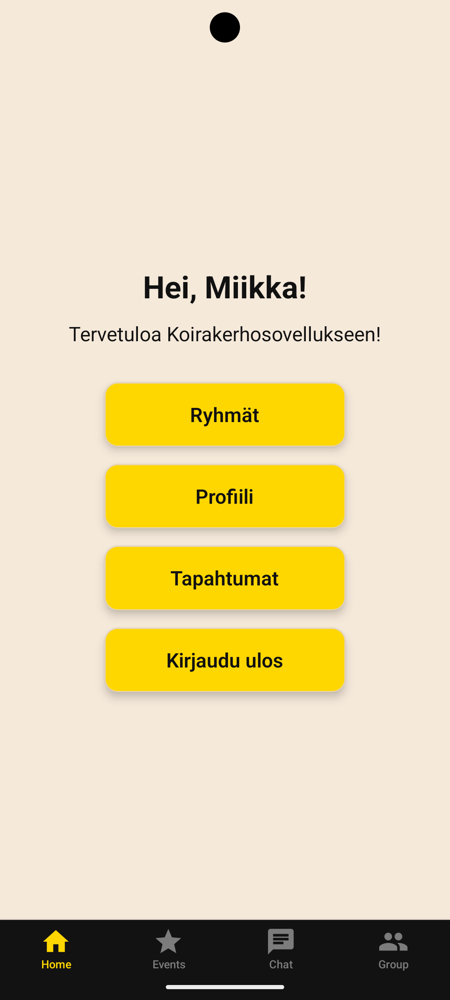
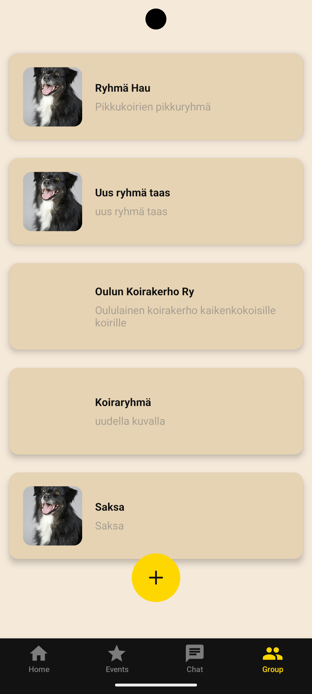
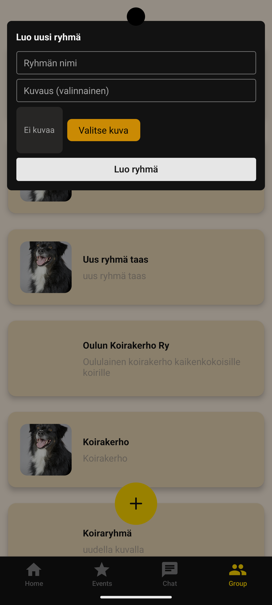
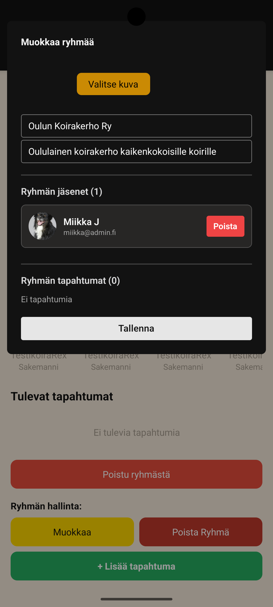
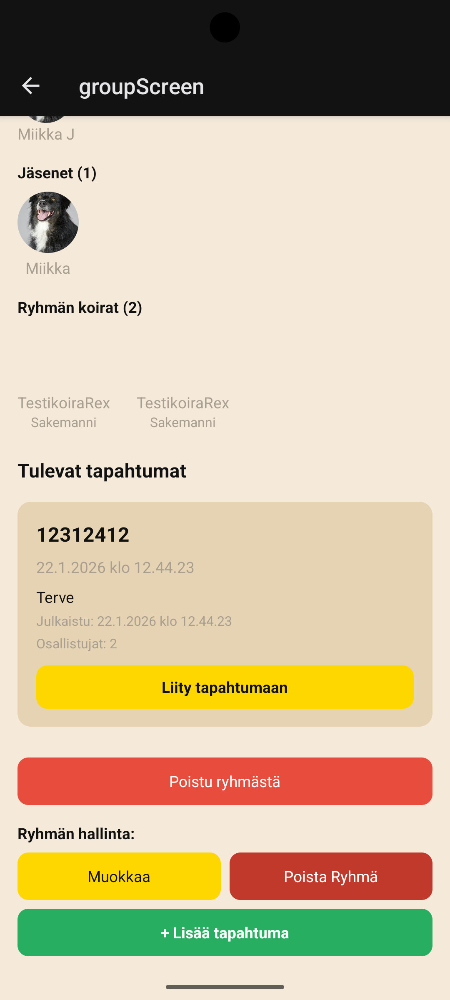
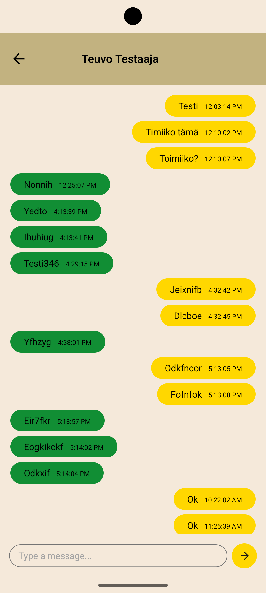

# 🐕 Koirakerho

Koirakerho is a mobile application designed to bring dog owners together in one place. The app combines dog profiles, community groups, events and messaging into a single mobile experience.

The project was built with **React Native and Expo**, with **TypeScript** used throughout the application. Firebase is used for authentication and cloud data storage, while the UI is built with reusable React Native components.

> This repository contains a student project developed as part of an information technology/software development project.

## ✨ Main Features

- 🔐 User registration and login
- 👤 User profiles
- 🐕 Dog profiles
- 👥 Create and manage dog-owner groups
- 🖼️ Group profile images
- 📅 Create and manage events
- 🙋 Join and leave events
- 💬 Chat and messaging
- 🐶 Connect group members with their dogs
- 🗺️ Location and map functionality
- 📆 Calendar integration
- 💳 Payment functionality through Stripe
- 📱 Mobile-first UI for Android and iOS

## 🛠️ Technologies

| Technology | Purpose |
|---|---|
| **React Native** | Cross-platform mobile application |
| **Expo** | Development and application tooling |
| **Expo Router** | File-based navigation |
| **TypeScript** | Type-safe application development |
| **Firebase Authentication** | User registration and authentication |
| **Cloud Firestore** | Users, dogs, groups, events and other application data |
| **Firebase Storage** | Image/file storage |
| **NativeWind** | Utility-first styling |
| **Gluestack UI** | Reusable UI components |
| **MapLibre** | Map and location functionality |
| **Stripe** | Payment functionality |
| **Expo Calendar** | Calendar integration |
| **AsyncStorage** | Persistent authentication state |

## 📱 Application Screens

### Home



The home screen acts as the main navigation hub for the application. It welcomes the logged-in user and provides quick access to the most important areas of the app:

- **Groups** – browse and manage dog-owner groups.
- **Profile** – view and manage the user's own information.
- **Events** – access events created in the application.
- **Log out** – sign out from the current account.

A persistent bottom navigation bar provides quick access to **Home, Events, Chat and Groups**.

---

### Groups



The Groups screen displays the dog communities available to the user.

Each group card can contain:

- Group image
- Group name
- Group description

The floating **+** button opens the group creation flow. This makes it possible to create a new community directly from the Groups screen.

The group system is backed by Firestore. Groups can contain members, associated dogs and events.

---

### Create a Group



The group creation dialog provides a simple form for creating a new community.

The user can:

1. Enter a group name.
2. Add an optional description.
3. Select a group image.
4. Create the group.

The authenticated user is automatically added to the newly created group and becomes one of its administrators.

The application also checks that a group name is not already in use before creating the group.

---

### Edit a Group



Group administrators can edit an existing group through the group management interface.

The screen provides controls for:

- Changing the group image
- Editing the group name
- Editing the group description
- Viewing current members
- Removing members
- Viewing group events
- Saving changes

The member management system also supports associating specific dogs with group members. This allows a group to keep track of which dogs belong to its members.

---

### Group Details



The group details screen brings the community information together in one place.

It displays:

- Group information
- Group members
- Dogs associated with the group
- Upcoming events
- Event participation controls

Users can join an available event directly from the event card.

Group members can also leave the group, while administrators have additional management controls:

- **Edit group**
- **Delete group**
- **Add event**

The group event system is connected to Firestore, where events store their creator and participant information.

---

### Chat



The chat screen provides a simple messaging interface for communication between users.

The interface contains:

- Incoming and outgoing message bubbles
- Message timestamps
- A text input field
- Send button
- Clear visual separation between the two participants

The chat interface is designed to make communication between dog owners straightforward without leaving the application.

---

## 🏗️ Architecture

The application separates the UI, business logic and Firebase data access into different parts of the project.

```text
Koirakerho
│
├── app/                  # Expo Router screens and routes
│
├── components/           # Reusable UI components
│
├── src/
│   ├── firebase/         # Firebase configuration and storage
│   ├── services/         # Authentication and data services
│   ├── context/          # Application state/context
│   ├── types/            # TypeScript data models
│   └── osrm/             # Routing/location related functionality
│
├── assets/
│   └── images/           # Application images and icons
│
├── firestore.rules       # Firestore security rules
├── app.json              # Expo application configuration
├── package.json          # Dependencies and scripts
└── README.md
```

### Service layer

The application uses dedicated service modules for the main data operations.

Examples include:

- `authService.ts` – registration, login and logout
- `dogService.ts` – creating, reading, updating and deleting dog profiles
- `groupService.ts` – creating and managing groups and members
- `eventService.ts` – creating events and managing participation
- `userProfileService.ts` – user profile operations

This separation keeps Firebase-specific operations outside the UI components and makes the application easier to maintain.

## 🔥 Firebase

Firebase is used as the backend platform.

### Firebase Authentication

Authentication supports:

- User registration
- Email/password login
- Logout
- Persistent authentication state

### Cloud Firestore

Firestore stores application data such as:

- Users
- Dogs
- Groups
- Group memberships
- Group events
- Event participants

For example, a group stores its member IDs and event IDs, allowing the application to connect people, dogs and events.

### Firebase Storage

Storage is used for application images such as profile and group images.

Firebase configuration values are loaded through Expo public environment variables rather than being hard-coded in the application source.

Example:

```env
EXPO_PUBLIC_API_KEY=your_api_key
EXPO_PUBLIC_AUTH_DOMAIN=your_auth_domain
EXPO_PUBLIC_DATABASE_URL=your_database_url
EXPO_PUBLIC_PROJECT_ID=your_project_id
EXPO_PUBLIC_STORAGE_BUCKET=your_storage_bucket
EXPO_PUBLIC_MESSAGING_SENDER_ID=your_sender_id
EXPO_PUBLIC_APP_ID=your_app_id
```

## 🚀 Getting Started

### Requirements

- Node.js
- npm
- Expo CLI / Expo tooling
- Android Studio for an Android emulator, or
- Expo Go / a development build for testing on a physical device

### Installation

Clone the repository:

```bash
git clone https://github.com/Oppari2025/Koirakerho.git
cd Koirakerho
```

Install dependencies:

```bash
npm install
```

Create the required environment configuration for Firebase.

Then start the Expo development server:

```bash
npx expo start
```

You can then run the application using:

```bash
npm run android
```

or:

```bash
npm run ios
```

For web development:

```bash
npm run web
```

## 📸 Screenshots

The screenshots in this README show the main user flows and demonstrate the application's visual design and functionality.

| Screen | Main purpose |
|---|---|
| Home | Main navigation |
| Groups | Browse dog communities |
| Create Group | Create a new group |
| Edit Group | Manage an existing group |
| Group Details | Members, dogs and events |
| Chat | Communicate with other users |

## 🎯 Project Goals

The goal of Koirakerho is to create a dedicated digital community for dog owners. Instead of using separate applications for communication, events and community management, the application brings these features together.

From a software development perspective, the project focuses on:

- Building a real mobile application with React Native
- Working with a cloud backend
- Designing and consuming typed data models
- Implementing authentication
- Managing relational-style relationships in Firestore
- Creating reusable UI components
- Handling image uploads
- Implementing event participation
- Building a messaging interface
- Working with location-based functionality
- Structuring a larger React Native application into maintainable services and components

## 📚 Project Repository

Source code:

https://github.com/Oppari2025/Koirakerho

## 👨‍💻 Authors

Developed as a student software development project.

## 📄 License

No separate open-source license is currently specified for this project.
